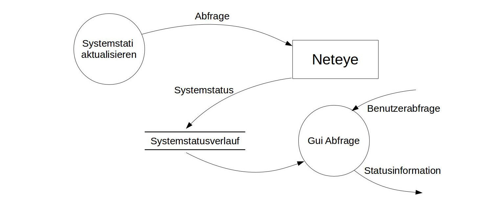

## Lösen eines begrenzten Datenhaltungsproblems mit einem nativen XML-Datenbanksystem am Beispiel einer Systemstatusdatenbank im IT-Support 
_Martin Eigenmann_

# Zusammenfassung
Die Seminararbeit des Moduls Datenbanken und Informationssysteme betrachtet das lösen eins spezifisches Datenhaltungsprolems, mittels eines nativen XML-Datenbanksystems.

Gezeigt wird, dass unter Verwendung eines nativen XML-DMBS, ein WEB-GUI  erstellt werden kann, welches den aktuellen Systemzustand der IT-Infrastruktur, sowie vergangene Fehler, übersichtlich darstellt.

# Design
Zur Lösung des Datenhaltungsproblems wird ein sehr konservativer Ansatz verwendet. Einerseits ist ein "Updater", also ein Modul, welches Informationen sammelt, sowie der "Reader", also das WEB-GUI implementiert worden. 

Das Datenflussdiagramm zeigt den unidirektionalen Fluss der Daten im System

